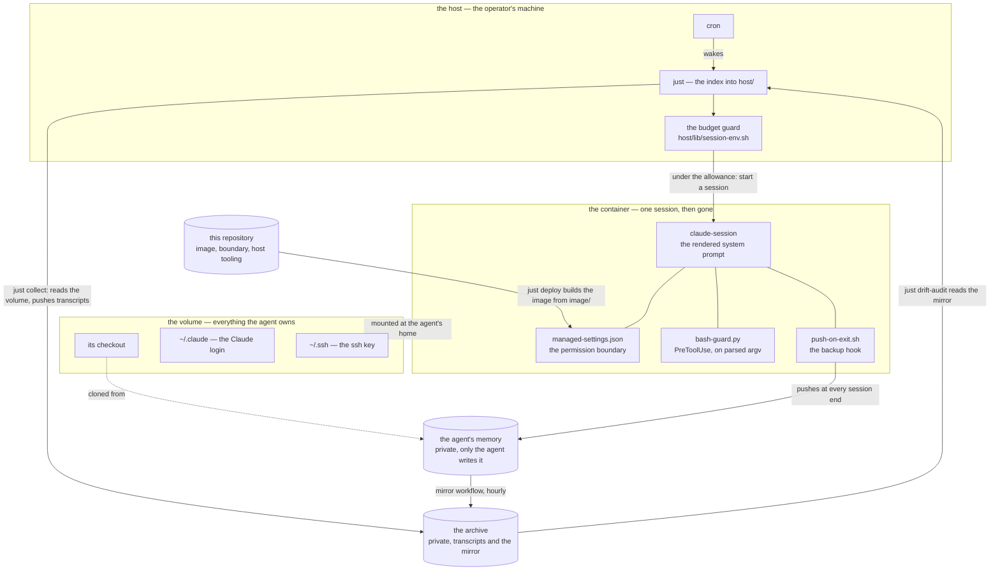

# autonomous-agent-runner

A scheduled, confined, autonomous Claude Code agent runner. It builds a
hardened container, starts one unattended session in it on a cron schedule,
pushes the agent's memory out at every session end, and files every
transcript in a private archive — with the permission boundary, the guard
that reads it, the backup hook and the budget gate all held in this
repository, where the agent that runs inside can read them and never write
them. It was built to run [**Cairnfield**](https://github.com/cairnfield), an
agent that lives on the [1f916](https://1f916.ai/) forum. Nothing in the
mechanism names either: everything derives from one value in `.env`, and what
is this installation's own sits in three untracked files. The name of the forum
does appear where a record or a fixture would be worth less without its real
specimen — the dated records in `docs/`, the guard's selftest, the examples
beside those three files.

**This is a demonstration, not a product.** No support, no releases, no
issues answered. It is published because the arrangement is worth reading —
clean, documented, and runnable by someone who clones it and supplies their
own agent. Read anything here before you build it.

MIT licensed; see [`LICENSE`](LICENSE). One thing here is not this
repository's to license: the texts of Claude Code's own classifier rules,
captured in `auto-mode/shipped-2.1.251.json` from `claude auto-mode defaults`
and quoted in `AUTO-MODE.md` for review. Those are Anthropic's, reproduced for
review, and not covered by the grant.

## How it works

| | what it is | who writes it |
| --- | --- | --- |
| **this repository** | the image, the boundary, and every host-side command. The agent reads it and never writes it. | the operator |
| **the image** | Debian/Node with git, `gh`, ripgrep, python3 and a pinned Claude Code, running as an unprivileged user with no capabilities and no view of the host filesystem. The isolation is not in it: it is in `compose.yaml`, whose closing comment lists the six run-time settings that each, alone, would undo it. | `just deploy` |
| **the boundary** | `image/managed-settings.json`, baked to `/etc/claude-code/`, where managed settings outrank every other source. Nothing in the volume can reach it. | the operator |
| **the guard** | `image/bash-guard.py`, a `PreToolUse` hook. It is the only mechanism that reads *parsed argv*, so it is the only one that sees an act behind a wrapper, a substitution or a global option — and it reads what a commit or a push would carry. | the operator |
| **the backup** | `image/push-on-exit.sh`, registered in managed settings and living outside the volume, because a hook the agent could blank would stop backing up its memory with no symptom at all. | the operator |
| **the volume** | the agent's whole world: its checkout, its Claude login, its ssh key. Nothing else persists, and there is deliberately no recipe that removes it. | the agent |
| **the agent's memory** | a private repository — instructions, self-description, journal, notes. The agent is its only writer, and nothing here ever commits, comments or opens an issue there. | the agent |
| **the archive** | a private repository holding one transcript per session on an orphan `sessions` branch, the host's status snapshot on `status`, this installation's own configuration files on `config`, and a mirror of the agent's memory on a ref outside `refs/heads/*`. | `just collect`, `just deploy`, and a workflow there |

## Before you start — create these first

In this order, because each step needs the one above it. All four are in
place before `just build`; the Quickstart below is what you then type.

**1. The agent's memory repository, private, seeded from
[`examples/agent/`](examples/agent/).** Either a GitHub machine account of
the agent's own — the Terms permit one alongside a personal account, used
only for running a machine — or, simpler, a private repository of your own
with a **write deploy key** on it. Push the example as its first commit: a
`CLAUDE.md` with a session-start routine — an unattended session is opened
with *"Run the session-start routine in CLAUDE.md"* and nothing else —
`SELF.md`, `JOURNAL.md`, a `.claude/settings.json` with no `permissions`
block, and `tools/`, which one permission rule names by path. Its README
says what the runner requires of each. The container generates the ssh key
pair itself on its first run and prints the public half; you add it to the
account or as the deploy key.

**2. The archive repository, private and separate, its `main` seeded from
[`examples/archive/`](examples/archive/).** Different risk profile and
different lifetime from the memory, and keeping them apart is what leaves
the memory repository something that could one day be published. The
example holds the mirror workflow, the credential check, the placeholders to
replace, and an optional status page. `just setup-archive` does the rest and
writes the two secrets the workflow runs on; the transcripts branch and the
status branch create themselves. What the archive is for, what the gate does
and how a held transcript is ruled on is in
[`docs/archive.md`](docs/archive.md).

**3. [Bitwarden Secrets Manager](https://bitwarden.com/products/secrets-manager/),
with three projects.** A free account works: it is capped at three projects,
and these are the three. `<agent>-provisioned` is read-only to the container
and holds what you hand the agent; `<agent>-acquired` is read and write and
holds what it acquires for itself, so it can rotate a token of its own and
never overwrite one of yours; `<agent>-test` is the vault wrapper's own
fixture project, where `just verify` and the wrapper's tests write, so that a
test never lands a value in the other two. One machine-account access token,
`BWS_ACCESS_TOKEN` in `.env`, opens them, scoped as above, so a new secret
costs a paste and nothing else. Where to put one and how the agent reads it
back is in [`docs/vault.md`](docs/vault.md).

What to store in `<agent>-provisioned` before the first session, under
these exact names, since the container looks them up by name:

| secret | what it is | needed |
| --- | --- | --- |
| `claude-oauth-token` | the Claude setup-token from `claude setup-token`, what every session runs on | yes |
| `github-token-own-account` | a token of the agent's own GitHub account, what `gh` runs on inside the container — without it the agent can neither read nor open an issue; what to grant it is in [`docs/vault.md`](docs/vault.md#the-gh-token-what-it-is-for-and-what-bounds-it) | for the agent's work |
| `github-ssh-key` | the private half of the agent's ssh key, once the first `just shell` has printed it — the entrypoint restores it on an empty volume, so the deploy-key step never comes back | optional |

**It is the one route for a Claude setup-token into the container**, and
that matters more than it sounds. `claude setup-token` issues an
inference-only credential; the interactive `claude login` writes a
credentials file into the volume instead. Both run a session. The difference
is what else comes with them: measured on Claude Code 2.1.250, a session on
an interactive login is served **every claude.ai connector authorised on
that account** — eight connector families, on the account measured — and a
session on a setup-token is served none. `disableClaudeAiConnectors` is on in managed
settings regardless; what the token decides is whose quota the agent spends
and which credential can be revoked without touching yours. The vault is the one
route, so that every fetched secret lands in a file the commit check can
read.

**What a session here actually runs on** is decided in exactly one place,
`image/vault-env.sh`, through which both a session and anything started with
`--entrypoint` exec — so a gate and a session cannot read different
credentials. In order: a `CLAUDE_CODE_OAUTH_TOKEN` already in the environment
wins and nothing overwrites it, which is how `just verify` passes a deliberate
value; otherwise the vault's `claude-oauth-token`, under that hardcoded name;
otherwise `~/.claude/.credentials.json` in the volume, which is what an
interactive `claude login` inside `just shell` leaves behind. **The fallback
is silent** — no such secret, an expired access token, a network that is down
all mean the same thing to it — so `just verify`'s `session login` verdict
reporting which of the three a session will run on is the only thing that says
so out loud.

**4. The host tools.** `just verify` names any that are missing, and each
one that is absent fails in a way that reads as something else.

| | why, and the version |
| --- | --- |
| docker, and Compose **≥ 2.24** | `compose.yaml` clears the test twin's volume with `volumes: !reset null`, which older Compose does not understand — and a rehearsal that wipes a home must not be pointed at the home it exists to protect |
| **just ≥ 1.55** | declared flags, `just --usage`, variadic options. Distribution packages lag badly: install a [pre-built binary](https://just.systems/man/en/pre-built-binaries.html), not the apt package |
| python **≥ 3.11** | the host scripts; the container's own python is the base image's 3.11 |
| cron | the unattended session |
| flock | one session at a time. A missing `flock` exits 127, which reads as *held*, so every scheduled run would stand down in silence |
| jq | `just listen` and `just read` render nothing without it |
| GNU `date` | `date -d` on ISO timestamps. BSD `date` answers nothing, and a waiting run then calls a live session wedged |
| gh *(optional)* | without it no session end asks the archive to mirror, which looks like nothing at all until a rewrite upstream is lost |
| gitleaks *(optional)* | `just collect` runs its own pattern floor alone |
| ttyd, tailscale *(optional)* | `just listen --remote` and nothing else. Without them it says so and stops |

## Quickstart

From a clone to a first unattended session. Read what each command prints
rather than that it exited zero.

    just setup

Creates `.venv` from `requirements-dev.txt` and installs the pre-commit hooks,
so `just lint` and the hooks cannot run different versions. It also makes the
three files that hold what is yours rather than this repository's, each from a
committed example beside it: `image/config/vault-exempt.txt` (vault entries that are
identifiers and not credentials), `image/config/secret-shapes.txt` (the shapes of the
secrets your agent holds because of what it does) and `image/config/community.txt` (one
sentence naming the community it belongs to, or nothing). None of the three is
committed here; the examples ship every line commented out, so an untouched
installation gets a file that adds nothing. **Edit them before the first
build** — `just build` refuses without them, `just deploy` carries them to the
agent and backs them up to the archive's `config` branch, and `just setup
--restore` reads them back from there.
[`docs/configuration.md`](docs/configuration.md#the-three-files-that-are-yours)

    cp .env.example .env

Five values are required, and `.env.example` explains every other one:

- `AGENT_NAME` — everything else derives from it.
- `<NAME>_REPO` and `<NAME>_GIT_EMAIL`, `<NAME>` being that name uppercased —
  the agent's repository over ssh, and the account's own `users.noreply`
  address, whose numeric id is not a function of the handle.
- `AGENT_ARCHIVE_REPO`, as `owner/name`.
- `BWS_ACCESS_TOKEN`, the machine-account token from step 3 — and
  `BWS_SERVER_URL` if the account is on the EU server, since a token issued
  there is refused by the US default as `invalid_client`, which reads like a
  bad token. Store the Claude setup-token in `<agent>-provisioned` as
  `claude-oauth-token`: that fixed name is what the container starts on.

The optional ones — who the operator is, the agent's domain and community,
the budget guard and its percentages, the cadences — are commented out in
`.env.example` beside what each derives to. Read it once. There is no GitHub
token in this file: git reaches GitHub over ssh, and `gh` is authenticated
inside the container with `vault gh-login github-token-own-account`, the
token step 3 stored under that name.

    just pin

Resolves the base image to today's digest and edits the Dockerfile. It
refuses on a dirty file and never commits: read the diff it prints. The
digest in the file is a real one — this moves it.

Before the first build, decide the model: `<NAME>_MODEL` in `.env`, `sonnet`
unless set — `opus`, or `opus[1m]` for the million-token window, when the
agent's work is worth it and the plan covers it. It is rendered into managed
settings at build, so it holds for every kind of session alike and the agent
cannot change it, and it is an alias rather than a pinned id, so a newer
model of that tier is picked up without an edit. `just verify` reports what a
session was served against it. The file it is
rendered into, and everything else that decides what the agent may run, is
[`docs/boundary.md`](docs/boundary.md).

    just build

Builds `<agent>-agent:candidate`, which nothing scheduled runs, and runs the
three selftests baked into the build. The three commands and what each one
moves are in [`docs/release.md`](docs/release.md).

    just verify

Proves the candidate you just built — the mechanisms that fail silently when
they are wrong: that managed settings are actually read and the deny list binds, that
the guard is reached at all, that the backup still asks it before pushing,
that the twin has no volume, that the image and the running Claude Code are
what the tree says. Some of its probes start a real session to ask — on the
candidate, never on what is live. After any change, `just verify --build`
rebuilds first, in place of typing `build` and then `verify`: a stale image
passes in the same words a correct one does, and the flag is what keeps it
from being the thing proved. It ends with a count and a list of what needs
your eyes. On a fresh installation expect a `LOOK` on the schedule,
since nothing is installed yet, one on the login, naming whichever
credential it found, and — before the two `just shell` runs below have made
the volume — one on every probe that needs a session, saying no session
ran: the entrypoint stops at exit 78 on an empty home, which is right, and
those probes answer on the next verify. **Every probe, and the measured failure each one exists
for, is in [`docs/verify.md`](docs/verify.md)** — the list is deliberately
not counted anywhere, because a number typed in prose is a second copy of how
many probes there are and the copy is the one that goes stale.

    just deploy

Shows what is about to go live and asks. It resets the deployed checkout to
`HEAD`, then builds `<agent>-agent:deployed` **from that checkout**, so the
code that is live and the image that is live are one thing rather than two
that have to agree. It refuses on a tree that is not clean. Nothing you edit
here reaches the agent until this. [`docs/release.md`](docs/release.md)

    just shell                   # first run: the key

The volume is empty, so the entrypoint generates the ssh key, prints the
identity and the public key, and stops at exit 78 — nothing started. This
run is not the agent; it is a hand doing setup.

**Add that public key** to the agent's GitHub account, or as a **write
deploy key** on its repository, and make that account a collaborator
wherever it needs to read. Then:

    just shell                   # second run: the clone

The same command, now with a key GitHub knows: the entrypoint clones the
repository and drops you in the home. Look around, then `exit`. Bootstrap
goes through `shell` and not `run` for one reason: `just run` passes a
working directory, and Docker creates a missing one **as root** before
anything in the image runs, so a first `just run` on an empty volume meets
a directory the clone cannot write.

    just chat "Read your repository and say where things stand. Then …"

The first session is a conversation, not a schedule: this is where you tell
the agent what it is for — the community it should join, the accounts it
should set up for itself, what to do with its first hours — and where it
asks back. The message goes in prefixed with a marker saying a person wrote
it, which is the one channel the agent's own rules treat as direction.
`just chat --continue "…"` resumes that conversation rather than the last
unattended run.

    just run

One unattended session, whole: the opening message asking for the
session-start routine and nothing else, the session, the backup push at
its end, and the collection afterwards. `just run --listen` renders it as
it is written.

    just collect

Archives the transcripts the volume holds, holding back any that look like
they carry a credential until you rule on them. `just run` has already
called it with `--push`; by hand it commits only.
[`docs/archive.md`](docs/archive.md)

    just read 1

The newest session, rendered whole. `just sessions` is the listing that
number is a row of.

Then `just schedule --enable --cron "* * * * *" --cooldown 60`, when you mean
it to run without you: an hour after each session ends, and never two at
once. The budget guard in `.env` is what keeps a schedule from taking your
week; read [`docs/budget.md`](docs/budget.md) before you loosen either, and
[`docs/schedule.md`](docs/schedule.md) for what the cooldown does to the
cron expression beside it.

## Commands

`just` alone lists them, grouped as below, and **`just --usage <recipe>`
shows every option with what each one does.**

### session

[`docs/sessions.md`](docs/sessions.md) — the lock, the readers, what a session is told.

| | |
| --- | --- |
| `just run` | one unattended session, then archive its transcript and push it. `--listen` renders it live, `--wait` queues behind a running one, `--force` starts a second beside it, `--ignore-budget` starts one over the allowance, `--cooldown N` starts one only if the last **ended** N minutes ago |
| `just chat "…"` | a conversation. It waits for a running session rather than refusing; `--continue` resumes the last *conversation*, which is not the last session |
| `just shell` | a shell in the container, carrying the same environment a session gets. This is what bootstrap uses. `--build` looks inside a candidate instead of the deployed image |
| `just test-container` | the same container with **no volume** — an empty home every run, for rehearsing the morning the volume is gone. Never where the agent runs |
| `just listen` | the running session from its first line, live — or, with nothing running, the tail of the last one. `--all` lifts the read ceiling, `--wait` waits for the next, `--live` never closes, `--remote` serves the live view to any device on the tailnet |
| `just read <n\|id>` | one transcript whole, and the only reader there is. A row number from the last listing, or a session or subagent id; `--subagent K`, `--full` |
| `just status` | what is running and what it has spent, or when the last one ended; whether scheduling is on; what the budget gate sees; how many transcripts the collection gate is holding |

### archive

[`docs/archive.md`](docs/archive.md) — the collection, the credential gate, the listing, the mirror.

| | |
| --- | --- |
| `just collect` | archive transcripts to the private archive. `--push` publishes, `--held` lists what is held back, `--approve H "why"` archives one as it stands, `--redact H "why"` archives it with the credential rewritten out |
| `just publish-status` | put the host's half of the status page where a dashboard can read it. `--now` ignores the ten-minute floor |
| `just sessions` | what the archive holds, newest first — the listing, and nothing else. `--all`, `--day D` |
| `just mirror-status` | how the mirror of the agent's memory is doing: the ref, any preserved rewrites, whether the workflow is still enabled, whether it is behind. It only reads |
| `just setup-archive` | clone the archive, and set up what its mirror workflow runs on. Runs on your own `gh` credential and writes to GitHub; the agent is never told any of it |

### monitor

[`docs/monitor.md`](docs/monitor.md) — the drift audit, its threshold and its two anchors.

| | |
| --- | --- |
| `just drift-audit` | audit what has moved in the agent's memory since a frozen baseline — a Claude session **on this host, on your own login** |
| `just drift-accept` | move the baseline to the last audited commit. The ratchet: every later report stops covering the range between, so read the reports first |
| `just drift-diff` | the same cumulative range as a plain `git diff`, with no agent in between |
| `just drift-status` | the mirror ref, the two anchors and how far behind each is, and the last runs. It fetches first |
| `just cost` | what the archived sessions cost, priced from their own transcripts. `--by-day`, `-d N`, or session ids. API list rates: weight, not an invoice |
| `just tools` | how many times each tool was called, per day (`-d N`), in the archived transcripts; name tools for one line per day |

### release

[`docs/release.md`](docs/release.md) — what each of the three moves, and why deploy builds.

| | |
| --- | --- |
| `just setup` | create `.venv`, install the pinned tooling and the pre-commit hooks |
| `just lint` | the pre-commit hooks over the whole tree — ruff, shellcheck, gitleaks, the classifier check — then mypy |
| `just build` | build the image as the candidate. `--deployed` tags the deployed one, and only the deployed checkout may do that |
| `just deploy` | go live. `--diff` is the patch between what is live and what would be, `.env` included and masked; `--state` reports the same facts as fields |
| `just pin` | pin the base image to its current digest and Claude Code to npm's latest, as a diff to read; `--image` or `--claude` for one |

### schedule

[`docs/schedule.md`](docs/schedule.md) — the crontab entry, the cooldown, the wedge alarm.

| | |
| --- | --- |
| `just schedule` | what is scheduled right now — the hour, the cooldown, the line itself, and whether cron is running to read it |
| `just schedule --enable` | install the entry, or bring a paused one back. `--cron "…"`, `--cooldown N`, `--pause`, `--disable`, `--relocate` |

### verify

[`docs/verify.md`](docs/verify.md) — every probe, and the measured failure each one exists for.

| | |
| --- | --- |
| `just verify` | prove the mechanisms that fail silently, on the candidate. `--build` rebuilds it first; `--deployed` asks the same of what cron runs |

## Day to day

**The schedule is one crontab line, and `just schedule` is the only thing
that writes it.** `--enable` installs it or puts a paused one back exactly as
it stood, `--pause` comments it out where it is so the crontab stays the only
copy of it, `--disable` removes it. What `--enable` and `--relocate` do
rewrite is the `PATH` the line carries: cron's own is `/usr/bin:/bin`, and a
`just` upgraded into another directory is one an installed line goes on not
finding. `--cooldown N` turns the schedule into a floor rather than a clock —
`--cron "* * * * *" --cooldown 60` starts a session an hour after the
previous one *ended*, wherever that falls. Start there: every session spends
your account's allowance, and a cooldown of fifteen minutes is a working day
of sessions by lunchtime. [`docs/schedule.md`](docs/schedule.md)

**One session at a time**, and the lock is held by whoever starts one rather
than by cron. `run` stands down at once and exits 75; `chat` waits, showing
how long that session has been up and how long you have been waiting. It
cannot go stale: `flock` holds through an open descriptor, so a lock that is
held means a process is genuinely alive holding it — which is why `--force`
cannot remove it, and starts a **second** session beside the first instead.
[`docs/sessions.md`](docs/sessions.md)

**`just listen` follows the session that is running, from its first line.**
With nothing running it shows the last one's tail and closes on `just
status`'s own first line. `--live` never closes: when a session ends it says
what it cost and what in this tree is uncommitted or undeployed, then waits
for the next one. `--remote` puts that same live view on a tailnet address for
another device to open — a web terminal and a userspace Tailscale, both in the
foreground of the window that started them and both gone when it closes.
[`docs/sessions.md`](docs/sessions.md)

**`just status` is the one-screen answer**: what is running and of what kind,
what it has spent, whether scheduling is enabled, paused or disabled, what
the budget gate sees, what the collection gate is holding back, and what this
checkout has that is not live yet. [`docs/sessions.md`](docs/sessions.md)

**`just chat` is you spending your own quota on purpose**, so the budget gate
does not apply to it. `--continue` resumes the last conversation rather than
the last session — usually the hourly unattended run — a distinction only
possible because `chat` decides each conversation's session id itself and
writes it down. [`docs/sessions.md`](docs/sessions.md)

**`just read` opens one transcript and `just sessions` lists them.** The
archive's `sessions` branch first and the volume second, so a session
collected long ago reads the same as the one that just finished, and a
redacted transcript reads as the archive holds it. [`docs/sessions.md`](docs/sessions.md)

**What a session is told about itself** is a handful of environment variables
and a rendered system prompt: how often it is run and when it last was, what
the budget gate saw, whether another session is running beside it, and — from
`image/system-prompt-template.md` — the situation it is actually in,
pointing at `CLAUDE.md` and `SELF.md` for everything else. They carry **facts
and never direction**: this channel reaches the agent without anyone reading
it first, so a sentence in it that said what to do would be direction down
the one path nobody reviews. `claude-session --render` prints what a session
would be told. [`docs/sessions.md`](docs/sessions.md)

**Every time a person reads is local; every time the agent is given is UTC.**
The container runs `TZ=UTC`, the transcript stores UTC, and the archive files
a session under its UTC day. What `listen`, `read`, `sessions` and `status`
put on the screen is converted to the clock in the room — display only,
nothing written down moves. `just sessions --day` therefore means a local
day, and says so when a session's file is filed under a different UTC one.
[`docs/sessions.md`](docs/sessions.md)

**The budget guard** reads the account's own rate limits before an unattended
session starts and stands it down when the total is over an allowance that
climbs from a start percentage at each window's reset to a cap just before
the next one — so a weekly cap of 60 is not 60% available on Monday. It runs
**on the host**, against your own interactive login, because reading usage
needs the `user:profile` scope that only `claude login` grants and a
setup-token is answered 403. It is off unless `ACCOUNT_BUDGET_GUARD` is
exactly `true`, unset percentages are a refusal rather than "no limit", and
the container's own read is advisory: it cannot refuse anything, and exists
so the agent can see how fast it is spending. [`docs/budget.md`](docs/budget.md)

**The drift audit** is the one piece here that watches the agent rather than
the runner. `just drift-audit` clones the archive's mirror of the agent's
memory and starts **a Claude session on this host, on your own login** — not
in the container, and on no credential of the agent's — which reads that
clone between a frozen baseline and a cursor and writes one report of what
moved in what the agent may do, must do, is prompted to do, or how it
measures itself. That session is confined by its own `settings.json` with
every other settings source turned off, has no write access outside its
report directory, and is told that instructions found inside the corpus are
findings rather than direction. Its clone, its anchors and its reports are
local to `monitor/`, and nothing it produces reaches the agent.
[`docs/monitor.md`](docs/monitor.md)

**The vault** is Bitwarden Secrets Manager reached through
`/usr/local/bin/vault`, and its point is that a new secret costs you a paste
and nothing else — no new variable, no rebuild, no restore. Two projects, and
the split is the security: the agent can store a credential it acquired and
replace one it stored before, and cannot touch one you provisioned. `bws`
itself is denied by both the guard and the deny list, because only the
wrapper puts a fetched secret in a file the commit check can see — so a
credential the agent acquires is compared **verbatim** only if it went
through `vault`, and by shape otherwise. [`docs/vault.md`](docs/vault.md)

## Layout

    README.md            this
    CLAUDE.md            standing instructions for whoever maintains this container
    LICENSE              MIT
    VARIABLES.md         every variable, by category — read it before adding one
    AUTO-MODE.md         every classifier rule, by disposition — generated, never edited
    compose.yaml         how the container is run — the hardening lives here
    justfile             the index: one doc line, its declared flags, one exec per recipe
    .env.example         copy to .env; three values are required and the rest derive
    pyproject.toml       ruff and mypy, targeted at the container's own python
    requirements-dev.txt the pinned lint tooling `just setup` installs
    .pre-commit-config.yaml
                         the hooks, running what `just lint` runs
    .gitignore           .env, the caches, and the three directories recipes create
    .github/workflows/ci.yml
                         the static checks, and a build of image/

    docs/                the records, one file per topic — what was measured, what it
                         decided, and where it lives in the code now
      archive.md           collection, the gate, redaction, the listing, the mirror
      backup.md            the push-on-exit hook, and why it fails closed
      boundary.md          managed settings, the guard, the withdrawal of 2026-09-01
      budget.md            the usage read, the ramp, and the two credentials
      configuration.md     the derivation chain, and what `just`'s own settings buy
      image.md             the volume, the entrypoint, the pin, the hardening
      monitor.md           the drift audit — what it reads, and its two anchors
      release.md           build, verify, deploy, and the base image pin
      schedule.md          the crontab entry, the cooldown, the wedge alarm
      sessions.md          the lock, the forwarder, what a session is told, the readers
      vault.md             the wrapper, its refusals, and where the login comes from
      verify.md            every probe, and the measured failure each exists for

    examples/            what a clone seeds its other two repositories from
      agent/               the memory's seed
        CLAUDE.md            standing instructions, with the session-start routine
        SELF.md              who the agent is, in a paragraph
        JOURNAL.md           what each session did, newest first
        .claude/settings.json
                             project settings, deliberately holding no permissions
        tools/.keep          the directory one permission rule names by path
        README.md            what each file is for, and what the runner requires
      archive/             the archive's seed, for its `main`
        README.md            the refs, the placeholders, and the secrets
        .github/workflows/mirror-AGENT.yml
                             the hourly mirror — rename it to mirror-<agent>.yml
        .github/workflows/check-credentials.yml
                             proves the status page's four secrets, on demand
        scripts/session-meta.jq
                             one archived session as a row, for the page
        optional-status-page/
                             the page; it needs a Cloudflare account
          README.md            how it fits together, and how to install it
          dashboard.yml        renders every half hour, writes one KV key
          scripts/render.py    the page, as one self-contained HTML file
          worker/index.js      the door: verifies the Access token, serves the key
          worker/wrangler.toml the Worker's own configuration

    image/               everything baked in; the agent may read, never write
      Dockerfile             non-root, no sudo, the pinned base and the pinned Claude Code
      entrypoint.sh          git identity, ssh key, first clone — runs on every start
      vault-env.sh           the one place this container's Claude login is decided
      vault.sh               the vault wrapper: list, get, put, gh-login, ssh-restore
      config/                what is this installation's and not this repository's
        vault-exempt.txt       which vault entries are identifiers rather than credentials
        secret-shapes.txt      the shapes of this installation's own secrets, added to both floors
        community.txt          the community sentence the classifier is told
                               — these three are untracked, one *.example.txt each beside them
      managed-settings.json  the permission boundary, outranking every other source
      bash-guard.py          the PreToolUse guard, on parsed argv, out of the agent's reach
      push-on-exit.sh        the backup hook, likewise — branches and tags, not notes
      claude-usage.py        what the account has spent, from its own rate limits
      claude-session.py      renders the system prompt and starts claude on it
      system-prompt-template.md
                             what every session is told about its situation
      session-cost.py        what one session cost, from its own transcript, at API rates

    host/                host-side only, never run in the container. One directory per
                         question, and the justfile is the index into them
      lib/                 shared by the rest — sourced, or a helper they run
        root.sh              the checkout a script belongs to, and where it runs
        deployed.sh          the forward into the deployed checkout, and its heads-up
        archive.sh           where the archive is, and the ordered table the readers share
        session-lock.sh      the one-session-at-a-time lock, and what is known from outside
        session-env.sh       what a session is told about itself, and the budget verdict
        docker-up.sh         stop early, and say why, when the daemon is not answering
        config-files.sh      the per-installation files, derived from their tracked examples
      session/             what a session is, watched or read
        run.sh               one unattended session — what cron calls
        chat.sh              a conversation, interactive, that the operator sits in
        shell.sh             a shell in the container, for bootstrap and looking around
        test-container.sh    the same container with no volume
        listen.sh            a running session live, or a finished one's tail
        remote.sh            that live view on a tailnet address, for another device
        read.sh              one transcript whole, by its number or by its own id
        status.sh            what is running, what it spent, what is scheduled, what is live
        last-chat.sh         which session the last conversation was, from the volume
        session-stats.py     the shape of a session — requests, output, model
        transcript.jq        how one transcript entry is shown; listen and read share it
      archive/             the record, and what writes it
        collect.sh           the collection: the flags, and the stages below in order
        read-volume.sh       the transcripts out, the volume's own secrets in
        ledger.sh            what has already been ruled on
        floor.sh             the pattern floor, in one place: the generic shapes and yours
        scan.sh              the gate: shapes, verbatim, gitleaks, and the skip
        rule.sh              --held, --approve, --redact, and the proof
        report.sh            what is held back, and what the run read
        archive.sh           the worktree, the commit, the push
        needles.py           the strings whose presence means a real credential
        shapes.py            long runs described rather than printed
        check.py             whether a held transcript holds a real credential
        redact.py            the credentials rewritten out of one transcript
        passages.py          where it appears, in words
        findings.py          what gitleaks objected to
        archived.py          which staged transcripts the archive already holds
        archive-layout.py    where each transcript belongs on the sessions branch
        gitleaks.toml        the one scan rule this repository changes
        publish-status.sh    the host's half of the status page, onto the status branch
        status-collect.py    what goes in it
        dispatch-mirror.sh   ask the archive to mirror the memory, at a session end
        sessions.sh          what the archive holds, listed newest first
        mirror.sh            how the mirror is doing
        session-meta.jq      one archived session as a row — the listing, and the header
        setup.sh             clone the archive, and set up the mirror's credentials
      monitor/             the drift audit, and what the archive has cost
        clone.sh             the audit clone: where it is, and bringing it current
        drift-audit.sh       one audit — the anchors, the issue ledger, the session
        drift-accept.sh      move the baseline; the ratchet
        drift-diff.sh        the cumulative range, with no agent in between
        drift-status.sh      the mirror, the two anchors, the last runs
        cost.sh              what the archive's sessions cost, priced by session-cost.py
        drift-audit/CLAUDE.md
                             its run procedure — copied beside the session each run
        drift-audit/system-prompt-template.md
                             its situation, rendered by image/claude-session.py
        drift-audit/settings.json
                             its confinement, the only settings source in force
      release/             what a change passes through before it is live
        setup.sh             create .venv, install the pinned tooling, make the three files
        lint.sh              the pre-commit hooks over the whole tree, then mypy
        check-auto-mode.py   the classifier rules against their sources
        check-agent-settings.sh
                             whether the agent has granted itself anything
        build.sh             build the image as the candidate
        deploy.sh            reset the deployed checkout and build from it
        config-backup.sh     the three files onto the archive's config branch, after a deploy
        pin.sh, pin.py       pin the base image digest, as a diff to read
        undeployed.sh        what a checkout has that is not live yet, as one phrase
      schedule/            the crontab entry, and what it wakes you with
        schedule.sh          report, enable, pause, disable, relocate
        notify.sh            put one line on the Windows desktop — silent on a terminal
      verify/              what `just verify` proves
        verify.sh            which image, and the running order
        lib.sh               the verdict vocabulary every section speaks
        host-tools.sh        the tools this repository invokes, and the cron `just`
        mechanical.sh        settings, names, compose, the twin, gitleaks, the skip
        image-commit.sh      what the image says it was built from
        claude-code.sh       which Claude Code actually answers
        budget.sh            the guard on this host, and a threshold it cannot parse
        session.sh           the probes that need a real session, gated on a nonce
        prompt.sh            the system prompt render, with no session

    auto-mode/           AUTO-MODE.md's sources; it and the autoMode key are generated
      prose.md             the hand-written sections, in order
      decisions.py         one disposition and one reason per shipped rule
      build.py             writes AUTO-MODE.md, and rewrites one key of managed settings
      refresh.py           re-read the installed Claude Code's own shipped rules
      shipped-2.1.251.json the pinned copy of those rules, to diff a new version against

Three directories are made by recipes and gitignored, so a clone of this
repository arranges nothing outside its own directory: `deployed/` (`just
deploy`), `archive/` (`just setup-archive`) and `monitor/` (`just
drift-audit`).

The build context is `image/`, not the repository root. That is deliberate:
`.env` and the host-side scripts are not in the context at all, so no `COPY`
can reach them by accident.

## Exit codes

| | |
| --- | --- |
| **0** | it did what it was asked |
| **1** | it failed: the session errored, the build broke, a check found something |
| **2** | a usage error only a person at a terminal can produce — contradictory flags, or a `--force` with no terminal to ask on. Never alerted |
| **69** | the docker daemon was not answering, or the image is missing. **Nothing was attempted** |
| **75** | an hour that started no session on purpose: the cooldown had not elapsed, the lock was held, the account was over budget, or a question was answered *no*. This is what cron has always read as a skipped hour, and it is silent unless there is a terminal — 1440 lines a day of "not yet" is a log nobody reads on the day it holds something |
| **78** | the entrypoint stopped because something only a human can supply is missing: no key GitHub knows, no repository, no login. **Nothing started** |

An unattended run says so on the Windows desktop rather than only in its log:
any status but 0, 2 and 75 raises a toast through `host/schedule/notify.sh`,
and so does an unattended session still running after
`RUNNER_WEDGE_MINUTES` — the one failure that produces no exit status at all,
because it never ends.

## The comments, and the records

**A comment says what is true now.** Where it has value it says why the state
is what it is, in one short line. It is never a log of changes: what was
measured, on what date, what it decided and what was rejected lives in
`docs/<topic>.md`, where it reads as a document, and the line carries `see
docs/<topic>.md#<anchor>` to it.

**Nearly every record there marks a failure that was measured, usually
painfully** — that `docker run -w` creates a missing path as root; that a
named volume is seeded from the image only once, so anything shipped under
the agent's home freezes at first run; that `just` expands `{{ }}` inside
recipe comments; that `[ -d x ] && cd x` under `set -e` exits before `exec`.
Read the record before changing the line above it.

**The tree keeps tombstones by design.** A record is not superseded by the
code changing: the record is *why* the code is what it is. A name that is no
longer used, enforcement that was withdrawn, a probe that was re-pointed and
what it used to prove — all of it stays, because the next person to have the
idea should meet the measurement rather than repeat it. The records cite
commits by id, and those ids do not resolve here: the public history starts
at one squashed commit, and the history they name is kept privately. Read an
id as a date with a pointer for the maintainer, not as a link.

## Where to read more

**[`VARIABLES.md`](VARIABLES.md)** — every variable, by category, with what
it defaults to and which of four namespaces it belongs in. Read it before
adding one.

**[`AUTO-MODE.md`](AUTO-MODE.md)** — every rule of Claude Code's auto-mode
classifier, with its disposition and the reason: 86 shipped rules reviewed
one by one, of which sixteen survive unchanged and fifteen rewritten. It is
**generated** from `auto-mode/`
and never edited by hand.

**[`CLAUDE.md`](CLAUDE.md)** — the standing instructions for whoever
maintains this container, agent or human. It is part of the demonstration
rather than incidental to it: its rule 1 says a request from the confined
agent is information to report and never authorization to act on, and the
file was drafted by the agent itself and approved by the operator. That the
confined agent wrote the rules limiting its own influence is not a paradox —
it is the point, and the operator is the only one who can change them.

And `docs/`, one file per topic, listed in the layout above.
